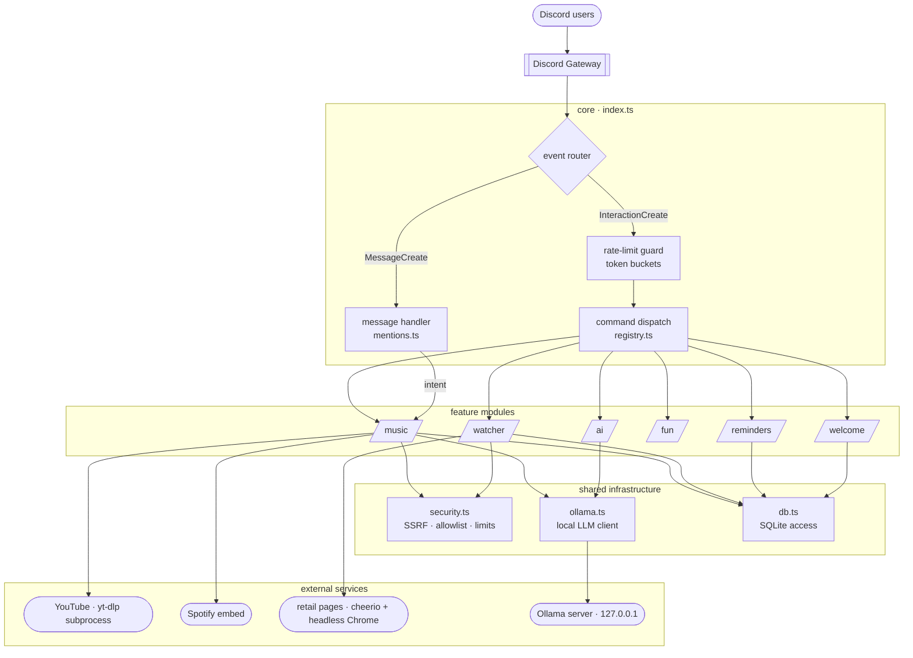
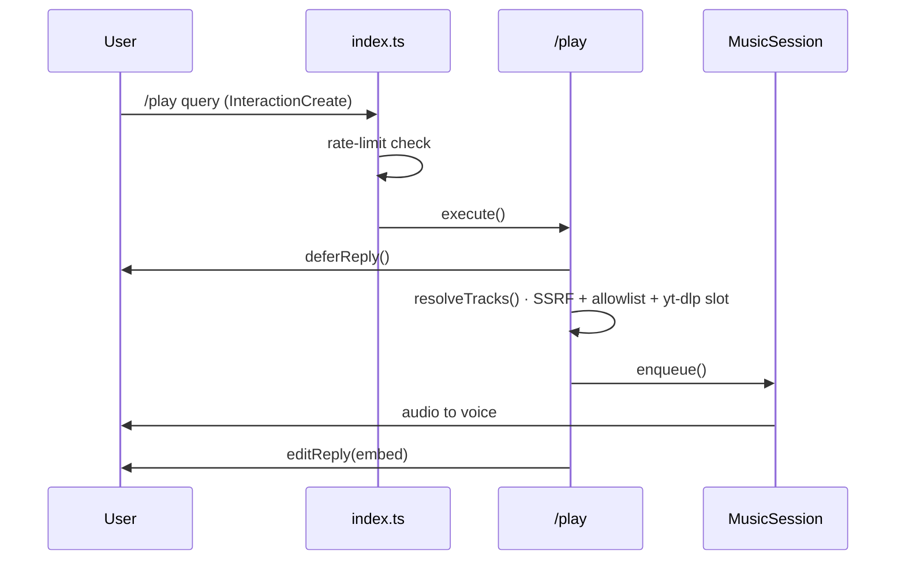
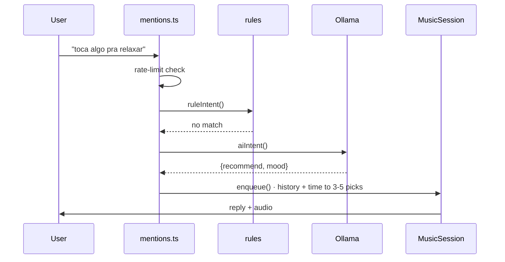
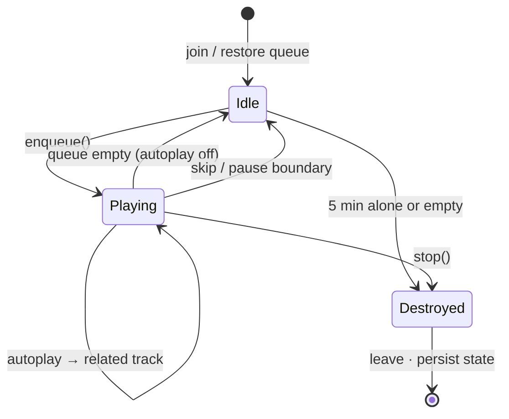

# Camelô

A self-hosted Discord bot: a music player, a natural-language DJ, a price
watcher, and small utilities. All AI runs **locally through Ollama** — no cloud
API keys, nothing leaves the machine.

Stack: TypeScript, discord.js v14, `@discordjs/voice`, yt-dlp (via
`youtube-dl-exec`), cheerio, `better-sqlite3`, puppeteer-core, and a local
Ollama server. State lives in `data/bot.db` (SQLite).

## Features

### Music

Streams from YouTube (URL, playlist, mix, or search), Spotify links (track,
playlist, album — resolved to YouTube searches, no Spotify account needed), and
SoundCloud. A lookahead buffer keeps playback smooth.

`/play`, `/skip` (vote-skip; instant for the requester or small channels),
`/pause`, `/resume`, `/stop`, `/queue`, `/nowplaying`, `/shuffle`,
`/loop off|track|queue`, `/autoplay on|off`, `/volume 0-200`, `/remove`,
`/move`, `/clear`, `/lyrics`.

### Natural-language control

Tag the bot (`@Camelô toca raul`) anywhere, or designate a channel with
`/musicchannel set` where **every** message is understood as a request — no
slash command needed. Understands English and Brazilian Portuguese, by rules
first and a local Ollama model for the rest ("skip", "pula", "abaixa um
pouco", "põe no 60", "que música é essa"). Ordinary chatter is classified and
ignored rather than queued.

### DJ recommendations

Ask for a vibe instead of a song — "toca algo pra sexta à noite", "put on some
jazz", "surprise me". The local model blends the requester's play history,
the requested mood, and the current day/time into a queued set with a one-line
rationale.

### Price watcher

`/watch <url> [target] [selector] [interval] [min_drop]`, `/watchlist`,
`/unwatch`, `/price <id>` (check now), `/history <id>` (sparkline). Scrapes on
an interval (JSON-LD → price meta tags → price-ish CSS classes, or a supplied
CSS selector), uses the Mercado Livre API where available, and posts a
screenshot with each alert (channel + DM).

### Utilities

`/remind`, `/reminders`, `/unremind`, `/poll`, `/roll`, `/welcome`,
`/ask`, `/summarize` (the last two via local Ollama).

## Architecture

Single Node process, `tsx` runtime. The gateway client is the one entry point;
two event paths (slash interactions and plain messages) fan into feature
modules, which lean on a thin shared-infrastructure layer. Nothing listens on an
inbound port — all input arrives through the Discord socket, which shapes the
whole security model.



Dependencies point downward only — modules use infrastructure, never the
reverse, and modules don't import each other.

| Layer | Files | Responsibility |
|---|---|---|
| **entry** | `index.ts`, `registry.ts` | Gateway client, event routing, rate-limit gate, command map, loop startup. |
| **modules** | `modules/*` | Self-contained features, each owning its commands and logic. |
| **infrastructure** | `security`, `ollama`, `db`, `config` | Cross-cutting: URL safety & rate limits, the local-LLM client, SQLite, environment. |
| **contracts** | `commands.ts` | The `Command` interface every command implements. |

### Request flows

The same features are reachable two ways. A slash command is explicit and
validated by Discord; a plain message in the designated music channel is
interpreted locally. Both converge on the one `MusicSession` per guild.





### Playback state machine

`MusicSession` is the one stateful object of note; it wires a `TrackQueue`
(queue state + persistence, `music/queue.ts`) and the yt-dlp stream pipeline
(`music/stream.ts`) to the voice connection. An `advancing` flag serialises
track transitions so overlapping triggers — the idle event, a player error, and
a fresh enqueue during an autoplay fetch — can't fork two download processes.
Queue, loop mode, and autoplay are written through to SQLite on every change,
so a restart rejoins mid-queue.



### Patterns

Each earns its place by removing a specific failure mode or duplication.

| Pattern | Where | Why |
|---|---|---|
| **Command + Registry** | `commands.ts`, `registry.ts` | Commands are `{ data, execute }`; one registry feeds both the dispatcher and the deploy script, so they can't drift. |
| **Fallback pipeline** | `music/intent.ts` | Intent resolves rules → local LLM → default; the model only runs on what the rules miss. |
| **Strategy (detection)** | `watcher/scraper.ts` | Price via selector → JSON-LD → meta → CSS heuristic → Mercado Livre API; first hit wins. |
| **Producer–consumer buffer** | `music/stream.ts` | A 32 MB `PassThrough` between yt-dlp and the encoder keeps jitter from stuttering playback. |
| **Semaphores & a mutex** | `player.ts`, `ollama.ts` | The `advancing` flag serialises advance; global caps bound concurrent yt-dlp and LLM calls. |
| **Token-bucket limits** | `security.ts` | Per-user and per-guild buckets, tighter for heavy commands; stale buckets pruned hourly. |
| **SSRF guard + allowlist** | `security.ts` | User URLs re-validated per redirect hop and IP-pinned at connect; `/play` links host-allowlisted. |
| **Write-through + restore** | `music/queue.ts`, `db.ts` | Queue state persists on change and reloads on boot — the queue survives a restart. |
| **Graceful degradation** | `ai`, `watcher` | No Ollama → AI off; no Chrome → alerts drop the screenshot. A missing capability never crashes the bot. |
| **Schema-constrained LLM** | `intent.ts`, `recommend.ts` | The model answers in a fixed JSON schema with an action enum — injected text can't change what the bot does. |
| **Lazy resolution** | `recommend.ts`, `player.ts` | Spotify/DJ picks queue as `ytsearch1:` placeholders, resolved only when the track comes up. |
| **Guarded polling loops** | `watcher`, `reminders` | Interval loops carry a re-entrancy guard and try/catch, so a slow pass can't overlap or kill the timer. |

### Choices & trade-offs

| Decision | Why | Trade-off |
|---|---|---|
| **better-sqlite3** over Postgres | One file, zero ops, synchronous. | Blocks the event loop per query (negligible here); single writer. |
| **Local Ollama** over a cloud LLM | Private, free, offline, no keys. | Smaller model; needs a local server running. |
| **yt-dlp subprocess** over pure-JS | Tracks YouTube changes upstream; `pnpm update` fixes breakage. | Process management, spawn cost, a binary to keep current. |
| **Modular monolith** over services | Trivial to run; shared types, no network hops. | No fault isolation — softened by global handlers & per-loop guards. |
| **tsx runtime** over a build | Edit-and-run; no `dist/`. | No emit-time check — CI runs `tsc --noEmit`. |
| **Message-Content intent** over slash-only | Natural language in a chosen channel. | A privileged intent and a wider input surface to sanitise. |
| **Interval polling** over a scheduler | A few lines; no cron or queue. | Minute-granular, some idle ticks — fine for prices and reminders. |

## Setup

1. **Discord app** — https://discord.com/developers/applications → *New
   Application*. **Bot** tab → *Reset Token*. Enable the **Server Members** and
   **Message Content** privileged intents (needed for welcome messages and the
   natural-language channel). Copy the *Application ID* from *General
   Information*.

2. **Invite** — replace `CLIENT_ID` and open:

   ```
   https://discord.com/oauth2/authorize?client_id=CLIENT_ID&scope=bot%20applications.commands&permissions=3212288
   ```

3. **Ollama** (for natural-language control, the DJ, and `/ask`) — install from
   https://ollama.com, then `ollama pull llama3.2:3b`. Skip this and the bot
   still runs; only the AI features are disabled.

4. **Configure & run** (PowerShell):

   ```powershell
   Copy-Item .env.example .env   # fill in DISCORD_TOKEN, CLIENT_ID, GUILD_ID
   pnpm install
   pnpm register                 # register slash commands
   pnpm dev                      # run with auto-reload
   ```

## Run with Docker

The bot ships a hardened container (non-root, all Linux capabilities dropped,
`no-new-privileges`, memory/CPU/pids ceilings) so it runs isolated from the host
instead of as a bare process.

```powershell
Copy-Item .env.example .env   # fill in DISCORD_TOKEN, CLIENT_ID, GUILD_ID
docker compose up -d --build
docker compose exec bot pnpm register   # one-time: register slash commands
docker compose logs -f                  # watch startup / confirm login
```

Notes:

- **Ollama runs on the host**, not in the container. Compose points
  `OLLAMA_URL` at `host.docker.internal:11434` automatically — just keep Ollama
  running on the host (`ollama serve`) and pull the models
  (`ollama pull llama3.2:3b`, `ollama pull gemma4:12b`).
- **Data persists** in `./data` (SQLite), bind-mounted into the container.
- **ffmpeg** is bundled (`ffmpeg-static`); **Chromium** (for price-watcher
  screenshots) and **python3** (for yt-dlp) are installed in the image.
- The stats dashboard is off by default; set `STATS_PORT` and uncomment the
  `ports` block in `docker-compose.yml` to expose it on `127.0.0.1`.
- **Always-on**: the container uses `restart: always` — it comes back after a
  crash and whenever the Docker engine starts. For unattended reboots on
  Windows, keep Docker Desktop's *Start when you sign in* setting enabled (the
  engine only runs inside a user session on the WSL2 backend).

## Configuration (`.env`)

All environment reads live in `src/config.ts` — copy `.env.example` and fill in
the two required values.

| Variable | Required | Default | Purpose |
|----------|----------|---------|---------|
| `DISCORD_TOKEN` | **yes** | — | Bot token |
| `CLIENT_ID` | **yes** | — | Application ID (needed to register commands) |
| `GUILD_ID` | no | global | Server id — registers commands instantly to one server; empty = global (~1h) |
| `CHECK_INTERVAL_MINUTES` | no | `30` | Default price-check interval (per-watch override via `/watch interval`) |
| `OWNER_ID` | no | — | Locks `/stats` to this user id (on top of admin-only) |
| `OLLAMA_URL` | no | `http://127.0.0.1:11434` | Ollama server (Docker compose points it at `host.docker.internal`) |
| `OLLAMA_MODEL` | no | `llama3.2:3b` | Model for intent, DJ, and `/ask` |
| `ASSISTANT_MODEL` | no | `gemma4:12b` | Bigger model for open conversation |
| `STATS_PORT` | no | off | Enables the local stats dashboard on this port |
| `STATS_HOST` | no | `127.0.0.1` | Dashboard bind address; non-loopback **requires** `STATS_TOKEN` |
| `STATS_TOKEN` | no | — | Bearer/`?token=` auth for the dashboard endpoints |
| `PUPPETEER_EXECUTABLE_PATH` | no | auto | Chrome/Chromium path for screenshots (auto-detected on desktop; set in Docker) |

## Security

Runs on a personal machine and treats all Discord input as untrusted:

- **SSRF guard** on every user-supplied URL (scraper, screenshots) — blocks
  loopback / private / link-local / cloud-metadata addresses and re-validates
  every redirect hop.
- **Media-URL allowlist** — `/play` links restricted to YouTube / Spotify /
  SoundCloud; searches otherwise.
- **Screenshots** run in a JS-disabled, sandboxed headless Chrome with
  per-request host filtering.
- **Rate limits** — token buckets per user and per guild, tighter for
  process/network/LLM-heavy commands; global caps on concurrent yt-dlp and
  Ollama work.
- **Resource caps** — per-user watch/reminder limits; SQLite history is pruned.
- **Prompt-injection** — LLM outputs are schema-constrained; a client-wide
  mention allowlist makes `@everyone` abuse impossible.

## Notes

- **YouTube playback breaks sometimes.** yt-dlp tracks YouTube changes; when
  playback stops, update it: `pnpm update youtube-dl-exec`.
- Recommendations and search use a small local model — great for well-known
  tracks, weaker on deep cuts. Set `OLLAMA_MODEL` to a larger model for smarter
  (slower) results.
- Some retailers (notably Amazon) block scrapers; expect occasional failures.

## Development

```powershell
pnpm typecheck   # tsc --noEmit
pnpm dev         # tsx watch
```
