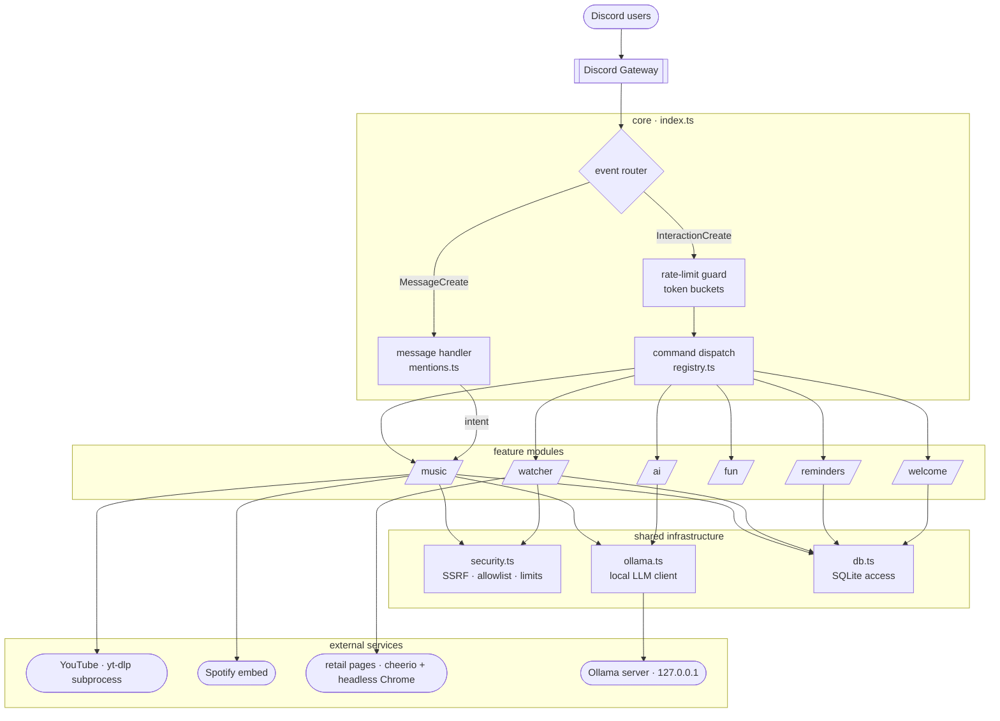
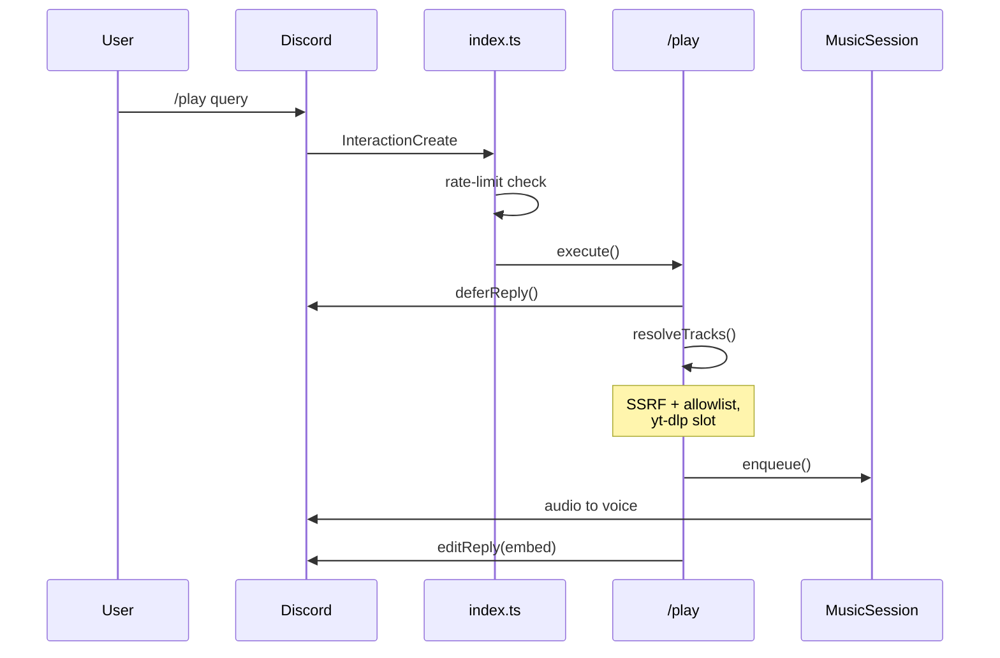
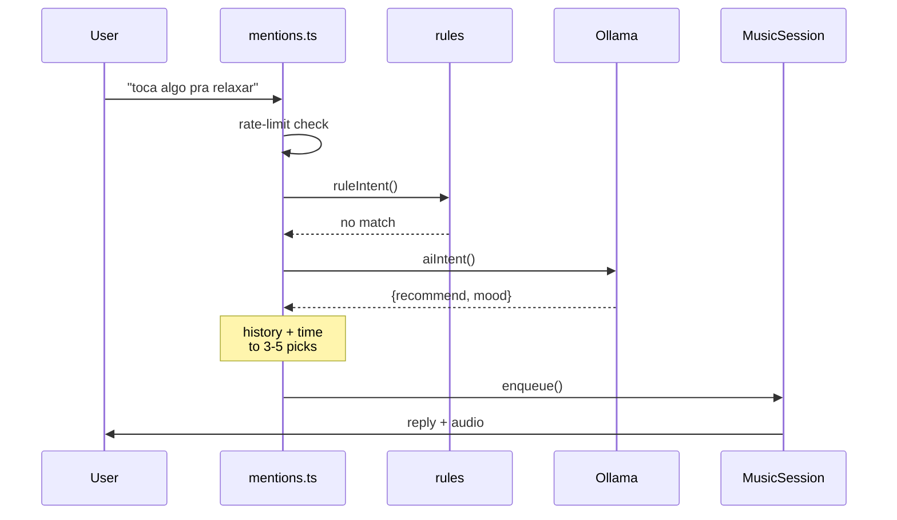
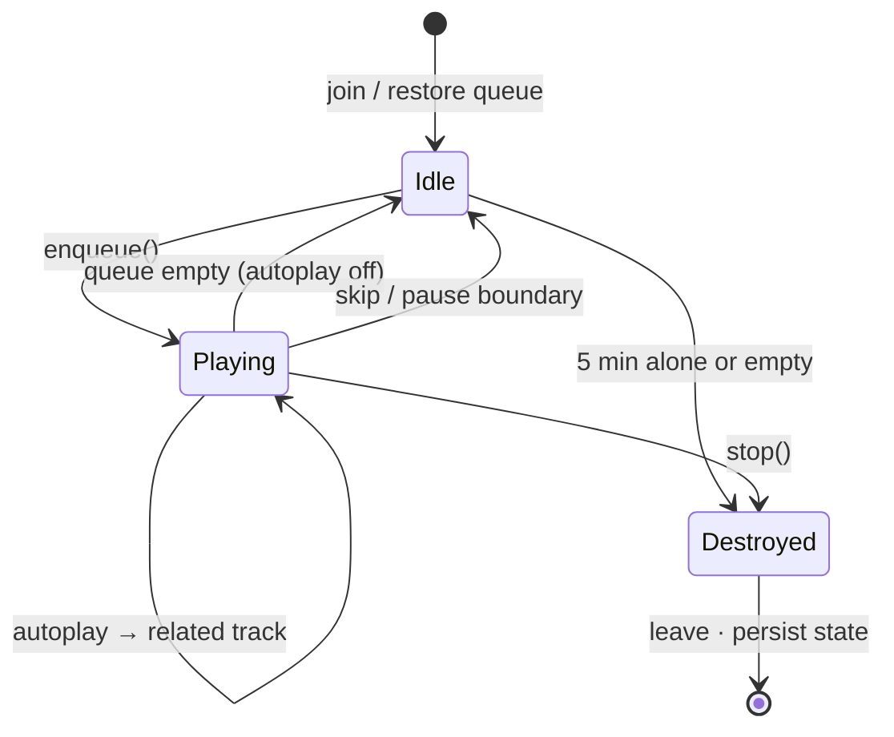

# Architecture

Camelô is a single-process, local-first Discord bot: a music player with
natural-language control, a price watcher, and small utilities — with every AI
call running on a local model (Ollama), so nothing leaves the machine.

- **Runtime:** TypeScript (ESM / NodeNext), one Node process, `tsx`.
- **Gateway:** discord.js v14 + `@discordjs/voice`.
- **State:** SQLite via `better-sqlite3` (`data/bot.db`).
- **External work:** yt-dlp (subprocess), cheerio + headless Chrome (scraping),
  a local Ollama server.

Nothing listens on an inbound port — all input arrives through the Discord
socket, which shapes the whole security model.

## System at a glance

One process. The gateway client is the single entry point; two event paths
(slash interactions and plain messages) fan into feature modules, which lean on
a thin shared-infrastructure layer and a handful of external services.

Solid edges are in-process calls; the leaf nodes are out-of-process
(subprocess, HTTP, or the Discord socket).

## Two request lifecycles

The same features are reachable two ways. A slash command is explicit and
validated by Discord; a plain message in the designated music channel is
interpreted locally. Both converge on the one `MusicSession` per guild.

**Slash command** — explicit, acknowledged in under 3 s with `deferReply`:

**Natural language** — rules first, local model for the rest:

## Playback state machine

`MusicSession` is the one stateful object of note. A single `advancing` flag
serialises track transitions so overlapping triggers — the idle event, a player
error, and a fresh enqueue during an autoplay fetch — can't fork two download
processes. Queue, loop mode, and volume are written through to SQLite on every
change, so a restart rejoins mid-queue.

## Patterns in play

Each earns its place by removing a specific failure mode or duplication.

| Pattern | Where | Why |
|---|---|---|
| **Command + Registry** | `commands.ts`, `registry.ts` | Every command is `{ data, execute }`. One registry array feeds both the runtime dispatcher and the deploy script — they can't drift out of sync. |
| **Fallback pipeline** | `music/intent.ts` | Intent resolves rules → local LLM → default. Cheap deterministic path first; the model only runs on what the rules miss. |
| **Strategy (detection)** | `watcher/scraper.ts` | Price found by trying, in order: explicit selector → JSON-LD → meta tags → price-ish CSS → Mercado Livre API. First hit wins. |
| **Producer–consumer buffer** | `music/player.ts` | A 32 MB `PassThrough` sits between yt-dlp and the voice encoder so network jitter can't starve playback into stutter. |
| **Semaphores & a mutex** | `player.ts`, `ollama.ts` | An `advancing` flag serialises track advance; global caps bound concurrent yt-dlp spawns and in-flight LLM calls. |
| **Token-bucket limits** | `security.ts` | Per-user and per-guild buckets, tighter for process/network/LLM-heavy commands. Stale buckets pruned hourly. |
| **SSRF guard + allowlist** | `security.ts` | Every user URL is re-validated on each redirect hop and pinned to its resolved IP at connect time; `/play` links are host-allowlisted. |
| **Write-through + restore** | `player.ts`, `db.ts` | Session state persists on change and reloads on boot — the queue survives a crash or redeploy. |
| **Graceful degradation** | `ai`, `watcher` | No Ollama → AI features quietly off. No Chrome → alerts drop the screenshot. Missing capability never crashes the bot. |
| **Schema-constrained LLM** | `intent.ts`, `recommend.ts` | The model must answer in a fixed JSON schema with an enum of actions — injected text can't change *what the bot does*. |
| **Lazy resolution** | `recommend.ts`, `player.ts` | Spotify and DJ picks queue as `ytsearch1:` placeholders, resolved to a real stream only when the track comes up. |
| **Guarded polling loops** | `watcher`, `reminders` | Interval loops carry a re-entrancy guard and a try/catch, so a slow or throwing pass can't overlap itself or kill the timer. |

## Choices & trade-offs

Each is a deliberate call for a personal, single-machine deployment — and what
it gives up.

| Decision | Why | Trade-off accepted |
|---|---|---|
| **better-sqlite3** over Postgres | One file, zero ops, synchronous — no pool, no daemon, no async ceremony. | Blocks the event loop per query (negligible at this size); a single writer. |
| **Local Ollama** over a cloud LLM | Private, free, offline, no API keys; messages never leave the machine. | Smaller model — weaker on deep cuts; needs a local server running. |
| **yt-dlp subprocess** over a pure-JS extractor | Tracks YouTube's changes upstream; one `pnpm update` fixes breakage. | Process management, spawn cost, a binary to keep current. |
| **Modular monolith** over services | Trivial to run and reason about; shared types, no network hops. | No fault isolation — softened by global crash handlers & per-loop guards. |
| **tsx runtime** over a compiled build | Edit-and-run; no `dist/`, no build step to babysit. | No emit-time check — CI runs `tsc --noEmit` to cover it. |
| **Message-Content intent** over slash-only | Natural language in a chosen channel — "toca raul", "skip", "abaixa aí". | A privileged intent and a wider input surface to sanitise. |
| **Interval polling** over a scheduler | A few lines; no cron, no queue, no external timer. | Minute-granular, some idle ticks — fine for prices and reminders. |

## Layered layout

Dependencies point downward only: modules use infrastructure, never the
reverse, and modules don't import each other.

| Layer | Files | Responsibility |
|---|---|---|
| **entry** | `index.ts`, `registry.ts` | Gateway client, event routing, rate-limit gate, command map, loop startup. |
| **modules** | `modules/*` | Self-contained features — music, watcher, reminders, fun, welcome, ai — each owning its commands and logic. |
| **infrastructure** | `security`, `ollama`, `db`, `config` | Cross-cutting services: URL safety & rate limits, the local-LLM client, SQLite access, environment. |
| **contracts** | `commands.ts` | The `Command` interface every command implements — the one shared shape between entry and modules. |

## Security model

The bot treats all Discord input as untrusted and opens no inbound ports.

- **SSRF guard** on every user-supplied URL (scraper, screenshots): blocks
  loopback / private / link-local / cloud-metadata ranges, re-validates every
  redirect hop, and pins the validated IP at connect time (closes DNS
  rebinding).
- **Media-URL allowlist** — `/play` links restricted to YouTube / Spotify /
  SoundCloud; anything else is treated as a search.
- **Screenshots** run in a JS-disabled, sandboxed headless Chrome with
  per-request host filtering.
- **Rate limits** — token buckets per user and per guild, tighter for
  process/network/LLM-heavy commands; global caps on concurrent yt-dlp and
  Ollama work; response bodies are size-capped.
- **Resource caps** — per-user watch/reminder limits; SQLite history pruned.
- **Prompt injection** — LLM outputs are schema-constrained, and a client-wide
  mention allowlist plus `parse:[]` on untrusted echoes make `@everyone` and
  stray user pings impossible.
